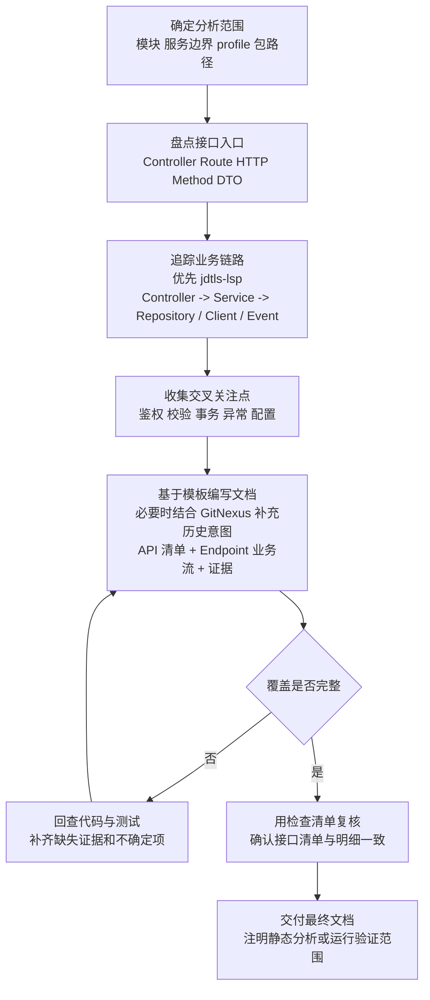

# API Docs Gen

## 概述

`api-docs-gen` 用于从已有的 Java Spring Boot 代码库中反向整理 API 文档和业务流程文档。它以当前代码为第一事实来源，沿着 Controller、DTO、Service、Repository、配置、异常处理和外部集成链路做静态分析，在必要时再用测试、OpenAPI 注解或历史信息补充上下文。

这个技能适合遗留服务接手、交接、审计准备、接口盘点、补全文档等场景。重点不是“按 Swagger 抄一遍接口”，而是把每个接口实际触发的业务规则、分支、状态变化、副作用和约束写清楚，并给出可追溯的代码证据。

如果环境中存在 `jdtls-lsp` 或 `GitNexus`，它们可以显著提升代码理解效率。`jdtls-lsp` 适合做 Java 定义跳转、引用查找、实现定位和调用链追踪；`GitNexus` 适合在当前代码之外补充历史意图、上下文演化和变更原因。但两者都是辅助理解工具，不能替代当前代码作为事实来源。

## 适用场景

- Spring Boot 服务已经上线或长期维护，但接口文档缺失、过期或不可信。
- 需要从代码中反向梳理真实接口行为，而不是依赖口头描述。
- 团队要对遗留系统做 onboarding、交接、审计或治理。
- 现有 Swagger / OpenAPI 只覆盖了路由定义，无法说明真实业务流程。
- 用户需要接口说明、业务逻辑说明、端到端调用路径说明，且要求基于代码事实。

## 不适用场景

- 新接口设计或契约先行设计。
- 只需要生成一份“看起来完整”的 API 清单，而不关心真实业务逻辑。
- 非 Spring Boot / 非 Java 主体代码库，且无法映射到类似分层结构。

## 核心原则

- 以当前代码为准，不能用 git 历史覆盖现状行为。
- 区分“观察到的事实”和“根据代码推断的意图”。
- 每个重要结论都应带上类名、方法名和文件路径证据。
- 接口文档必须同时覆盖 API 形状和业务执行路径，二者缺一不可。
- 如果行为不确定，要明确标注不确定性，而不是补写推测性规则。
- 如果用户用中文提出需求，输出文档也应使用中文。

## 默认产出

默认生成一个 Markdown 文档；如果服务规模较大，再拆分为索引页和按控制器或领域拆分的明细页。

| 场景 | 默认路径 |
| --- | --- |
| 中小型服务 | `docs/api/<service-or-module>.md` |
| 大型服务 | `docs/api/<service>/index.md` 以及按控制器或领域拆分的文件 |

如果仓库已有现成的文档规范，或用户明确给出目标路径，应优先遵循仓库或用户约束。

## 目录结构

```text
skills/api-docs-gen/
├── README.md
├── SKILL.md
├── agents/
│   └── openai.yaml
└── references/
    ├── doc-template.md
    └── springboot-analysis-checklist.md
```

## 标准工作流

下图描述了从确定分析范围到生成最终 API 与业务文档的标准流程：



### 1. 确定分析范围

首先明确目标模块、服务边界、运行 profile 和主要包路径。若用户请求范围过大，应先限定某个 module、bounded context 或 controller 集合，再进入详细分析。

### 2. 盘点接口入口

扫描并汇总以下入口：

- `@RestController`
- `@Controller`
- `@RequestMapping`
- `@GetMapping`
- `@PostMapping`
- `@PutMapping`
- `@PatchMapping`
- `@DeleteMapping`

这一阶段需要把类级别和方法级别路由组合成最终路径，并补齐 HTTP 方法、鉴权注解、请求 DTO、响应 DTO、参数来源和异常映射。

### 3. 追踪业务链路

从每个 controller 方法继续向下分析：

- 调用了哪个 service 方法
- 经过了哪些业务分支和规则判断
- 是否涉及事务、幂等、缓存、异步任务、事件发布
- 是否落库、查库、调用 MQ、HTTP client、RPC client 或文件存储
- 是否受 feature flag、profile 或配置项影响

每个接口在整理文字业务流之外，还应补一段 Mermaid `sequenceDiagram`，把请求从入口 Controller 经过 Service、Repository，到外部系统、副作用以及最终响应的主路径画出来。图中只能出现能从代码中追踪到的参与方；如果某一步是根据上下文推断出来的，需要在图附近或正文中明确标注“推断”。

如果可用，优先用 `jdtls-lsp` 做定义跳转、引用查找和调用链分析；语言服务不可用时，再退回到针对性代码搜索。

## 工具增强

### `jdtls-lsp`

如果环境可用，`jdtls-lsp` 应被视为理解 Spring Boot Java 代码的首选辅助工具，尤其适合以下任务：

- 从 controller 方法跳到 service、repository、client 的真实实现
- 查找接口实现类、重写方法和引用位置
- 沿调用层级追踪业务流，而不是只靠文本搜索猜测
- 确认 DTO、实体、枚举和返回类型的真实定义

它的价值在于减少“看起来像调用链”的误判，提升文档证据的准确性。

### `GitNexus`

如果环境可用，`GitNexus` 可以帮助理解代码“为什么这么写”，但不能覆盖代码“现在实际上做了什么”。适合用于：

- 补充某段复杂逻辑的历史背景
- 理解为何引入某个分支、补丁、防御式判断或配置开关
- 交叉验证某个行为是否由历史 bug、兼容性要求或审计需求驱动

使用边界应明确：

- `GitNexus` 用于解释意图和演化，不用于替代当前代码行为。
- 当历史记录与当前实现冲突时，应以当前代码为准。
- 如果最终结论依赖历史推断，需要在文档中明确标注为推断，而不是事实。

### 4. 收集交叉关注点

除单个接口本身外，还需要统一梳理以下横切行为，并在接口章节中引用：

- 认证与授权
- 参数校验与序列化规则
- 事务边界、并发与幂等
- 全局异常处理与错误映射
- `@Profile`、`@ConditionalOnProperty`、配置开关
- 过滤器、拦截器、统一响应包装

### 5. 用模板写文档

建议基于 [`references/doc-template.md`](./references/doc-template.md) 落盘，至少覆盖：

- 分析范围与证据来源
- 系统摘要
- API inventory
- 横切行为
- 每个 endpoint 的详细业务流
- 每个 endpoint 的 Mermaid 时序图
- 数据模型与枚举
- 未确认逻辑
- 验证方式与残留空白

### 6. 用清单做收尾检查

交付前，使用 [`references/springboot-analysis-checklist.md`](./references/springboot-analysis-checklist.md) 做覆盖复核，确保每个接口都同时具备：

- 路由与请求/响应信息
- 业务链路说明
- 下游依赖与副作用
- 成功与失败路径
- 代码证据

## 每个接口必须回答的问题

- 暴露了什么路由和 HTTP 方法？
- 请求字段、校验规则和序列化约束是什么？
- 入口 controller 和实际处理 service 分别是谁？
- Mermaid 时序图是否清楚展示了主链路、关键分支和主要副作用？
- 关键业务规则、条件分支和状态变化是什么？
- 发生了哪些数据库、缓存、消息队列或第三方调用？
- 成功返回和失败返回分别有哪些形态？
- 是否受鉴权、配置、特性开关或运行环境影响？

## 推荐文档结构

建议遵循以下组织方式：

1. 先给出范围和证据表。
2. 再给出系统摘要和 API 总表。
3. 统一整理横切行为。
4. 逐个接口展开详细业务流。
5. 最后列出模型说明、未确认项和验证结论。

接口较多时，建议按 controller 或业务域拆分文档，而不是把几十个接口堆进一个超长文件。

## 质量门禁

出现以下情况时，说明文档质量不足，需要回退修正：

- 只抄写注解里的路由，没有拼接类级和方法级路径。
- 记录了 DTO 字段，但没有检查校验注解和序列化规则。
- 描述了 service 行为，却没有继续追踪下游调用。
- 用历史提交或口头说明替代当前代码事实。
- 把推测性业务意图写成确定事实。
- 漏掉鉴权、事务边界、副作用或异常处理。
- 只有文字描述，没有为接口补 Mermaid 时序图，或图与正文/代码链路不一致。
- API inventory 中的接口数量与明细章节对不上。

## 协作与验证建议

- 可运行时，建议补充 `curl` 或 `httpie` 示例，或引用现有集成测试作为验证证据。
- 无法运行时，需要明确说明本次结论基于静态分析。
- 如果服务超过 20 个接口或 5 个 controller，应优先按控制器或领域拆分输出。

## 快速使用建议

在会话开头可以显式声明：

> 我正在使用 api-docs-gen，根据当前 Spring Boot 代码反向整理 API 文档和业务逻辑文档，并为关键结论附上代码证据。

推荐执行顺序：

1. 圈定模块和分析范围。
2. 盘点控制器和接口入口。
3. 逐个接口向下追踪业务链路。
4. 汇总横切行为和配置影响。
5. 用模板生成文档。
6. 用检查清单复核覆盖率与证据完整性。

## 参考文件

- 模板：[`references/doc-template.md`](./references/doc-template.md)
- 复核清单：[`references/springboot-analysis-checklist.md`](./references/springboot-analysis-checklist.md)

## 文档价值

这个技能的价值在于把“代码里到底实现了什么”变成可阅读、可核验、可交接的文档资产，降低以下风险：

- 接口行为依赖个人记忆
- Swagger 与真实逻辑脱节
- 交接时无法快速理解业务路径
- 审计或排查时缺少证据链
- 多控制器、多 profile、多集成点系统的认知成本过高
