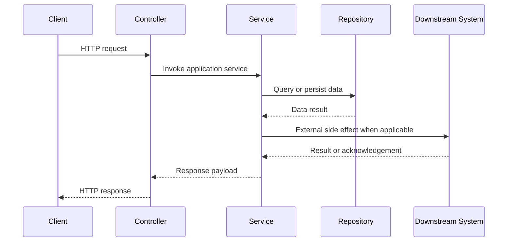

# Spring Boot API + Business Logic Document Template

Translate section titles to the user's language when needed. Keep evidence paths and symbol names exact.

## 1. Scope and Evidence

- Service or module:
- Repository path:
- Runtime profile or environment assumptions:
- Documentation type: static analysis only or static plus runtime verification
- Generated at:

| Evidence Type | Path or Symbol | Why It Matters |
| --- | --- | --- |
| Controller |  |  |
| Service |  |  |
| DTO |  |  |
| Repository or Client |  |  |
| Config or Advice |  |  |
| Test or Spec |  |  |

## 2. System Summary

- Core business capability:
- Main bounded contexts or modules:
- External dependencies:
- Cross-cutting concerns:

## 3. API Inventory

| Domain | Method | Path | Summary | Auth | Request | Response | Notes |
| --- | --- | --- | --- | --- | --- | --- | --- |
|  |  |  |  |  |  |  |  |

## 4. Cross-Cutting Behavior

### 4.1 Authentication and Authorization

### 4.2 Validation and Serialization

### 4.3 Transactions, Idempotency, and Concurrency

### 4.4 Exception Handling and Error Mapping

### 4.5 Feature Flags, Profiles, and Configuration

## 5. Endpoint Details

Repeat this section for each endpoint or group of tightly related endpoints.

### `METHOD /path`

- Entry point: `Controller#method`
- Purpose:
- Request DTO and required fields:
- Validation rules:
- Response DTO or payload:
- Auth and permission checks:

#### Business Flow

1. Controller delegates to:
2. Service performs:
3. Domain rules and branches:
4. Persistence and state changes:
5. External calls, events, cache, or async work:
6. Success outcome:
7. Failure paths:

#### Mermaid Sequence Diagram

Replace placeholder participants with concrete code-backed symbols. Remove repository or downstream participants when they do not exist, and use `alt` or `opt` blocks for important branches or conditional side effects.

#### Evidence

- Controller:
- Service:
- Downstream symbols:
- Related tests or specs:

## 6. Data Models and Enumerations

List DTOs, entities, enums, and mapping rules that materially affect API behavior.

## 7. Open Questions and Uncertain Logic

- Uncertain point:
- Why it is uncertain:
- What evidence was missing:

## 8. Verification

- Static checks performed:
- Runtime verification performed:
- Sample request examples:
- Known documentation gaps:
