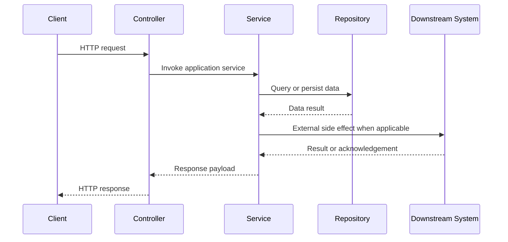

# Spring Boot API + Business Logic Document Template

Translate section titles to the user's language when needed. Keep evidence paths and symbol names exact.

## 1. Scope and Evidence

- Service or module:
- Repository path:
- Runtime profile or environment assumptions:
- Documentation type: static analysis only or static plus runtime verification
- Generated at:

| Evidence Type | Path or Symbol | Why It Matters |
| --- | --- | --- |
| Controller |  |  |
| Service |  |  |
| DTO |  |  |
| Repository or Client |  |  |
| Config or Advice |  |  |
| Test or Spec |  |  |

## 2. System Summary

- Core business capability:
- Main bounded contexts or modules:
- External dependencies:
- Cross-cutting concerns:

## 3. API Inventory

| Domain | Controller | Method | Path | Summary | Auth | Request | Response | Notes |
| --- | --- | --- | --- | --- | --- | --- | --- | --- |
|  |  |  |  |  |  |  |  |  |

## 4. Cross-Cutting Behavior

### 4.1 Authentication and Authorization

<!-- Security filters, @PreAuthorize rules, role/permission requirements, anonymous-access exceptions -->

### 4.2 Validation and Serialization

<!-- @Valid / @Validated groups, field-level constraints, custom validators, Jackson config, hidden or read-only fields -->

### 4.3 Transactions, Idempotency, and Concurrency

<!-- @Transactional propagation and isolation, optimistic/pessimistic locking, idempotency keys, retry policies -->

### 4.4 Exception Handling and Error Mapping

<!-- @ControllerAdvice handlers, exception-to-HTTP-status mappings, error response envelope shape -->

### 4.5 Feature Flags, Profiles, and Configuration

<!-- @Profile, @ConditionalOnProperty, config properties that switch behavior, environment-specific overrides -->

## 5. Endpoint Details

Repeat this section for each endpoint or group of tightly related endpoints.

### `METHOD /path`

- Entry point: `Controller#method`
- Purpose:
- Request DTO and required fields:
- Validation rules:
- Response DTO or payload:
- Auth and permission checks:
- Cross-cutting references: (e.g., auth → §4.1, transactions → §4.3, exceptions → §4.4)

#### Business Flow

1. Controller delegates to:
2. Service performs:
3. Domain rules and branches:
4. Persistence and state changes:
5. External calls, events, cache, or async work:
6. Success outcome:
7. Failure paths:

#### Mermaid Sequence Diagram

```mermaid
sequenceDiagram
    participant Client
    participant Controller
    participant Service
    participant Repository
    participant Downstream as Downstream System

    Client->>Controller: HTTP request
    Controller->>Service: Invoke application service
    Service->>Repository: Query or persist data
    Repository-->>Service: Data result
    Service->>Downstream: External side effect when applicable
    Downstream-->>Service: Result or acknowledgement
    Service-->>Controller: Response payload
    Controller-->>Client: HTTP response
```

Replace placeholder participants with concrete code-backed symbols. Remove repository or downstream participants when they do not exist, and use `alt` or `opt` blocks for important branches or conditional side effects. For reactive (WebFlux) endpoints, annotate async subscription points with a note (e.g., `Note over Service: subscribeOn(...)`) rather than drawing separate reactive chain steps.

#### Evidence

- Controller:
- Service:
- Downstream symbols:
- Security or config:
- Related tests or specs:

## 6. Data Models and Enumerations

List DTOs, entities, enums, and mapping rules that materially affect API behavior. Omit fields that have no impact on API contracts or business rules.

| Type | Name | Key Fields / Values | Used By | Notes |
| --- | --- | --- | --- | --- |
| DTO |  |  |  |  |
| Entity |  |  |  |  |
| Enum |  |  |  |  |

## 7. Open Questions and Uncertain Logic

| # | Uncertain Point | Why It Is Uncertain | Missing Evidence | Business Impact |
| --- | --- | --- | --- | --- |
| 1 |  |  |  |  |

## 8. Verification

- Static checks performed:
- Runtime verification performed:
- Sample requests (curl / httpie — mark each as `[verified]` or `[hypothetical]`):
- Known documentation gaps:
