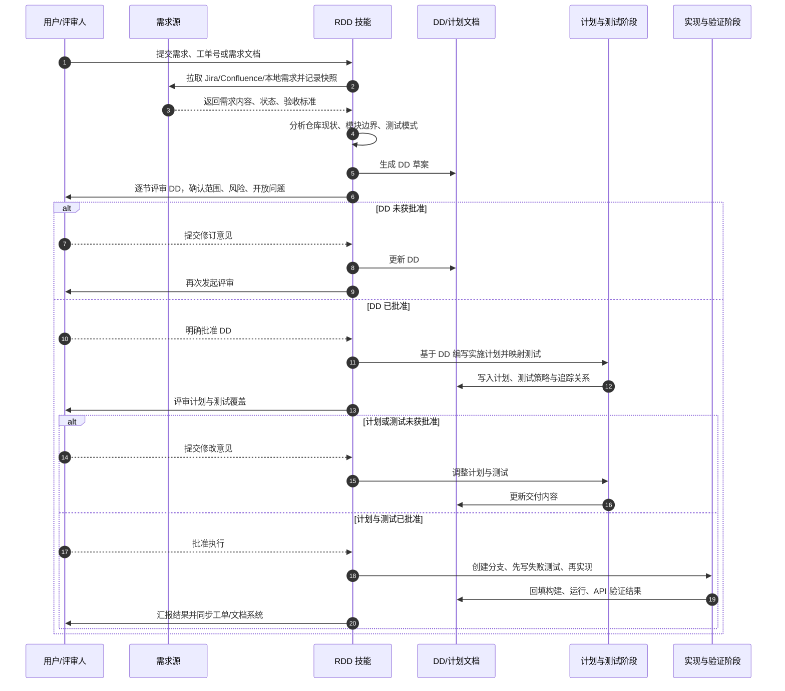

# Requirements-Driven Development

## 概述

`requirements-driven-development` 是一个以需求为锚点的软件交付技能。它要求在进入计划、测试与编码之前，先完成需求来源采集、当前系统分析、DD（Design Document / 需求设计文档）编写与人工评审，从而确保实现过程可追溯、可审计、可验证。

该技能适用于 Jira 驱动、Confluence 支撑、需求文档完备，或对范围控制、业务规则、接口契约、合规性有明确要求的任务场景。核心目标不是“尽快开始写代码”，而是“在正确理解需求之后，再有约束地交付代码”。

## 核心原则

- 先需求，后设计，先评审，后编码。
- DD 是实施阶段的权威输入，不允许由聊天上下文或临时记忆替代。
- 验收标准必须显式落盘，并能映射到测试。
- 范围变更必须先更新 DD，再调整计划和实现。
- 最终 DD 不是草稿，而是覆盖实现结果与验证证据的活文档。

## 适用场景

### 建议使用完整 RDD 流程

- 需求来源分散在 Jira、Confluence、本地文档或多方描述中。
- 需求存在歧义，需要先澄清范围和业务规则。
- 变更跨模块、跨服务、跨公共 API，或涉及数据结构演进。
- 任务需要留存审计证据、审批记录、验证结果。
- 缺陷修复必须建立明确的回归测试与需求追踪关系。

### 可使用轻量 RDD 的条件

仅当以下条件同时满足时，才建议使用轻量模式：

- 变更局部、低风险。
- 需求已经明确，无需额外设计澄清。
- 不涉及跨服务协作、数据库模式变更或公共接口设计。
- 使用简化 DD 仍能保留需求快照、验收标准、审批记录与验证结论。

轻量模式缩减的是文档篇幅，不是可追溯性。

## 标准产出物

| 产物 | 默认路径 | 作用 |
|---|---|---|
| DD 文档 | `docs/dd/<jira-key-or-topic>.md` | 固化需求来源、分析结论、验收标准、设计决策、评审记录与实施证据 |
| 实施计划 | `docs/plans/<jira-key-or-topic>.md` | 将批准后的 DD 拆解为可执行任务，并明确文件、命令、预期结果 |
| 测试用例或测试骨架 | 贴近代码目录或测试目录 | 将 DD 中的验收标准转化为可执行验证 |
| 分支 | `<jira-key>-<short-slug>` | 将代码工作与需求跟踪项绑定 |
| 最终回填记录 | 更新到 DD 与工单系统 | 形成闭环，包括验证结果、偏差说明与后续项 |

如果仓库已有更强的路径规范，应优先遵循仓库约定。

## 目录结构

```text
skills/requirements-driven-development/
├── README.md
├── SKILL.md
├── agents/
│   └── openai.yaml
└── references/
    ├── dd-template.md
    ├── lightweight-dd-template.md
    ├── plan-and-test-handoff.md
    ├── requirement-source-fallback.md
    ├── springboot-maven-checklist.md
    └── traceability-examples.md
```

## 工作流总览

### 阶段 1：获取需求来源

优先级建议如下：

1. Jira Issue / Epic
2. 与 Issue 关联的 Confluence 页面
3. 仓库内本地需求、架构、设计文档
4. 用户直接提供的需求文本

此阶段必须记录需求来源快照，至少包括：

- 工单号、页面 ID 或文档标题
- 来源链接或可识别的文档标识
- 抓取时间
- 当前状态、版本或修订信息
- 关键需求摘录
- 缺失来源与降级方案

当主需求源不可访问时，应明确记录缺失事实，不得凭空补齐验收标准。

### 阶段 2：分析现有项目上下文

在撰写 DD 之前，需要结合当前代码库做事实性分析，包括但不限于：

- 现有模块边界、分层与接口位置
- 相关控制器、服务、仓储、DTO、任务调度或事件处理链路
- 现有测试模式、测试夹具和验证入口
- 构建、运行、调试与验证命令
- 环境约束、配置依赖、外部系统接入点
- 最终准备采用的执行环境，例如本地 shell、devcontainer 或 CI

### 阶段 3：编写 DD

DD 是从“需求”走向“实施”的正式中间产物。建议内容包括：

- 需求来源与快照信息
- 问题定义与目标结果
- 当前状态分析
- 细化后的功能性与非功能性需求
- 假设、依赖、风险与待确认问题
- 可直接驱动测试的验收标准
- 需求到测试的可追踪矩阵
- 设计级别的实现思路

模板选择建议：

- 标准场景使用 [`references/dd-template.md`](./references/dd-template.md)
- 低风险局部变更使用 [`references/lightweight-dd-template.md`](./references/lightweight-dd-template.md)
- 需求到测试映射可参考 [`references/traceability-examples.md`](./references/traceability-examples.md)

### 阶段 4：DD 评审与批准

DD 保存后，不能直接进入编码。必须经过人工评审，重点确认：

- 需求理解是否准确
- 范围边界是否清晰
- 风险与开放问题是否被明确记录
- 验收标准是否足以约束后续实现

批准结论、评审人、时间戳和批准范围必须写回 DD。若仅部分批准，也必须说明哪些内容被延后或排除。

### 阶段 5：计划与测试交接

DD 获批后，才能进入计划与测试设计。该阶段应遵循：

- 计划必须以 DD 为准，不以聊天记忆为准。
- 每一项验收标准都应映射到至少一个测试。
- 优先先写失败测试或测试骨架，再进入实现。
- 任务拆分必须足够小，且附带明确文件路径、命令与预期结果。

交接前建议检查 [`references/plan-and-test-handoff.md`](./references/plan-and-test-handoff.md)。

### 阶段 6：分支、实现与验证

计划和测试获批后，进入受控实施阶段：

- 使用与需求跟踪项绑定的分支命名。
- 按计划逐步实施，不得默默扩大范围。
- 行为变更优先先更新测试。
- 在约定执行环境中完成编译、运行与功能验证。
- 将实际命令与结果记录回 DD。

对于 Java Spring Boot Maven 项目，建议额外检查 [`references/springboot-maven-checklist.md`](./references/springboot-maven-checklist.md)。

### 阶段 7：闭环与同步

收尾时需要完成以下动作：

- 用最终实现结果更新 DD
- 回填验证证据、API 验证、构建结果和偏差说明
- 形成适合写入 Jira/Confluence 的总结
- 在可用时同步工单状态、评论与链接

## 时序图

下图描述了从需求获取到 DD 评审、计划测试批准，再到实现和闭环的标准交互过程：



## 关键质量门禁

以下任一情况都应视为流程失控，需要立即纠正：

- 在 DD 保存并评审前开始编码
- 验收标准只存在于聊天记录，没有写入 DD
- 需求快照缺失、过期或不可核验
- 计划偏离 DD，且未先更新 DD
- 测试仅围绕实现细节，而不是需求行为
- 已有工单号却未绑定分支命名
- 跳过构建或 API 验证，且没有记录明确阻塞原因
- 依据记忆更新 Jira/Confluence，而不是依据最终 DD

## 推荐协同技能

本技能通常作为需求驱动任务的入口，与以下技能协作使用：

- `writing-plans`：根据已批准的 DD 生成可执行实施计划
- `test-driven-development`：先写失败测试，再推进实现
- `using-git-worktrees`：隔离不同任务上下文
- `subagent-driven-development`：按计划拆分执行、审查与集成
- `executing-plans`：在计划已经明确时推进实现
- `verification-before-completion`：在收尾前做最终验证
- `brainstorming`：当需求本身仍不清晰时先做澄清

## 快速使用建议

在会话开始时，建议显式声明：

> 我正在使用 requirements-driven-development，将当前需求先整理为经过评审的 DD，再进入计划或编码。

推荐执行顺序：

1. 获取并固化需求来源。
2. 分析代码库与现有实现。
3. 在 `docs/dd/` 下编写 DD。
4. 发起人工评审并等待明确批准。
5. 生成计划与测试映射。
6. 评审计划和测试覆盖。
7. 创建分支，按测试驱动方式实现。
8. 回填 DD、验证结果与工单状态。

## 文档价值

该技能的价值不在于增加文档数量，而在于降低以下风险：

- 需求理解漂移
- 范围失控
- 测试与验收标准脱节
- 实现完成后缺少证据链
- 多方协作时缺少统一事实来源

当团队需要可追踪、可审计、可复盘的研发过程时，`requirements-driven-development` 可以作为需求到实现之间的标准控制面。
