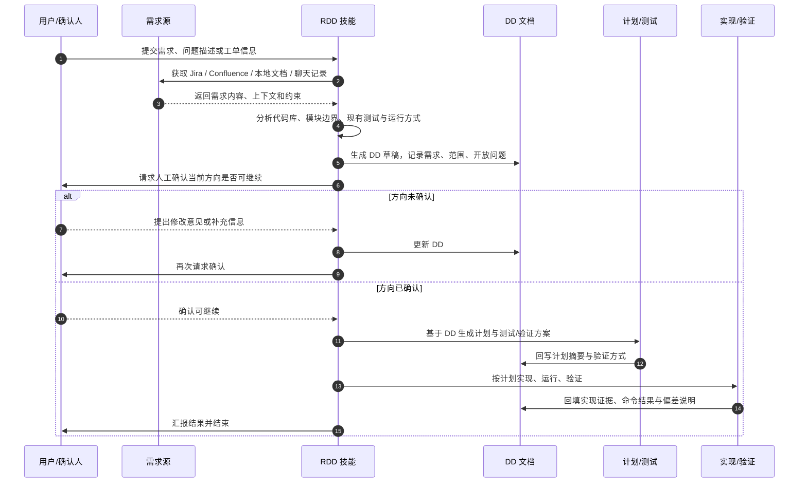

# Requirements-Driven Development

## 概述

`requirements-driven-development` 是一个以需求为锚点的软件交付技能。

它适用于这些场景：
- 需求还不够清楚，需要先整理问题、目标、约束和开放问题
- 变更跨模块、跨服务、跨公共 API，不能只靠聊天记忆推进
- 任务需要保留需求来源、设计决策、验证结果和实现证据
- 需要先把需求写清楚并得到人工确认，再进入计划和编码

这个技能的核心不是“尽快开始写代码”，而是：
- 先记录真实需求，而不是猜需求
- 先让人确认方向可继续，再做计划和实现
- 用同一个 DD 模板贯穿澄清、设计、验证和收尾

## 核心原则

- 不在需求仍是猜测时直接编码
- 需求不清楚时，先头脑风暴、整理事实与假设
- DD 是实施阶段的当前事实记录，不依赖聊天记忆
- 使用统一 DD 模板，小任务删无关章节，大任务保留完整章节
- 当需求源本身带有验收标准时，可直接引用；没有时，用验证说明替代
- 重要需求、设计决策、开放问题和验证方式要写进 DD
- 进入计划和实现前，需要人工确认当前方向可继续

## 适用方式

### 什么时候用

- 新功能
- 缺陷修复
- 需求不明确的探索型任务
- 合规、审计、接口契约敏感的改动

### 什么时候不要用重流程

即使是很小的改动，也可以使用这个技能，但不需要把每个章节都写满。

做法是：
- 仍然使用统一 DD 模板
- 只保留有价值的章节
- 优先用短 bullet，而不是长篇说明

## 标准产出物

| 产物 | 默认路径 | 作用 |
|---|---|---|
| DD 文档 | `docs/dd/<jira-key-or-topic>.md` | 记录需求来源、问题定义、设计决策、开放问题、验证方案和实施证据 |
| 实施计划 | `docs/plans/<jira-key-or-topic>.md` | 把已确认的 DD 转成可执行任务 |
| 测试或验证记录 | 贴近代码目录或测试目录 | 证明改动满足预期行为 |
| 分支 | `<jira-key>-<short-slug>` 或语义化名称 | 绑定需求上下文与代码实现 |
| 最终回填 | 更新 DD 与工单系统 | 形成闭环 |

## 统一 DD 模板

本技能只保留一个通用 DD 模板：

- [`references/dd-template.md`](./references/dd-template.md)

使用方式：
- 小任务：删掉无关章节，只保留有价值内容
- 大任务：保留完整章节
- 未知项：明确标成开放问题，不要伪造确定性

建议优先保留这些章节：
- `Metadata`
- `Requirement Snapshot`
- `Problem Statement`
- `Scope`
- `Refined Requirements`
- `Acceptance Criteria / Verification Notes`
- `Design Approach`
- `Open Questions`
- `Review Log`
- `Implementation Evidence`

## 参考文件

- [`references/dd-template.md`](./references/dd-template.md)
  统一 DD 模板
- [`references/traceability-examples.md`](./references/traceability-examples.md)
  与统一模板对齐的示例片段
- [`references/requirement-source-fallback.md`](./references/requirement-source-fallback.md)
  正式需求源缺失时的降级处理规则
- [`references/springboot-maven-checklist.md`](./references/springboot-maven-checklist.md)
  Spring Boot Maven 项目的最低验证清单

## 工作流

### 阶段 0：澄清需求

当需求不清楚时，先做这些事：
- 明确问题、目标和约束
- 区分事实、假设和待确认项
- 记录可选方案和权衡
- 把开放问题写进 DD 草稿

### 阶段 1：获取需求来源

优先级建议：
1. Jira / Epic
2. 关联 Confluence
3. 仓库内本地文档
4. 用户提供的文本或聊天记录

至少记录：
- 来源是什么
- 什么时候获取的
- 当前状态或版本
- 关键需求摘录
- 哪些来源缺失

如果正式来源拿不到，使用：
- [`references/requirement-source-fallback.md`](./references/requirement-source-fallback.md)

### 阶段 2：分析项目现状

在写 DD 前，先看：
- 模块边界
- 接口和数据结构
- 现有测试模式
- 构建和运行命令
- 环境与外部依赖

### 阶段 3：编写 DD

用统一 DD 模板写第一版 DD。

要求：
- 先写 DD，再做计划
- 不知道的内容写成开放问题
- 不要为了“看起来完整”而编造细节

### 阶段 4：人工确认

DD 写完后，先让人确认当前方向是否可继续。

确认的重点：
- 需求理解是否正确
- 范围是否清楚
- 哪些问题仍未解决
- 验证方式是否足够

### 阶段 5：计划与测试

确认后，再进入计划和测试设计。

要求：
- 计划以 DD 为准
- 测试或验证要覆盖关键行为
- 小任务可以轻量，但不能完全跳过验证思路

### 阶段 6：实现与验证

实现时：
- 不要默默扩 scope
- 行为变化优先补测试
- 记录实际执行命令和结果

### 阶段 7：闭环

完成后，把这些写回 DD：
- 实际改了什么
- 怎么验证的
- 是否有偏差
- 后续待办是什么

## 时序图

```mermaid
sequenceDiagram
    autonumber
    participant U as 用户/确认人
    participant S as 需求源
    participant A as RDD 技能
    participant D as DD 文档
    participant P as 计划/测试
    participant I as 实现/验证

    U->>A: 提交需求、问题描述或工单信息
    A->>S: 获取 Jira / Confluence / 本地文档 / 聊天记录
    S-->>A: 返回需求内容、上下文和约束
    A->>A: 分析代码库、模块边界、现有测试与运行方式
    A->>D: 生成 DD 草稿，记录需求、范围、开放问题
    A->>U: 请求人工确认当前方向是否可继续

    alt 方向未确认
        U-->>A: 提出修改意见或补充信息
        A->>D: 更新 DD
        A->>U: 再次请求确认
    else 方向已确认
        U-->>A: 确认可继续
        A->>P: 基于 DD 生成计划与测试/验证方案
        P->>D: 回写计划摘要与验证方式
        A->>I: 按计划实现、运行、验证
        I->>D: 回填实现证据、命令结果与偏差说明
        A->>U: 汇报结果并结束
    end
```

## 质量门禁

以下情况说明流程出了问题：
- 需求还没记录清楚就开始编码
- 关键决策只存在于聊天里，没有写进 DD
- 需求来源缺失，却没有记录 fallback 来源
- 计划偏离 DD，但没有先更新 DD
- 测试只验证实现细节，不验证真实行为
- 验证跳过了，但没有写清楚阻塞原因

## 推荐协同技能

- `brainstorming`
  需求模糊时先做澄清
- `writing-plans`
  把 DD 转成可执行计划
- `test-driven-development`
  先补测试，再推进实现
- `using-git-worktrees`
  隔离任务上下文
- `subagent-driven-development`
  并行拆分任务
- `executing-plans`
  顺序执行已确认的计划
- `verification-before-completion`
  完成前做最终核对

## 一句话用法

可以这样开始：

> 我正在使用 requirements-driven-development，先把需求整理到 DD，并在人工确认后再进入计划或编码。
