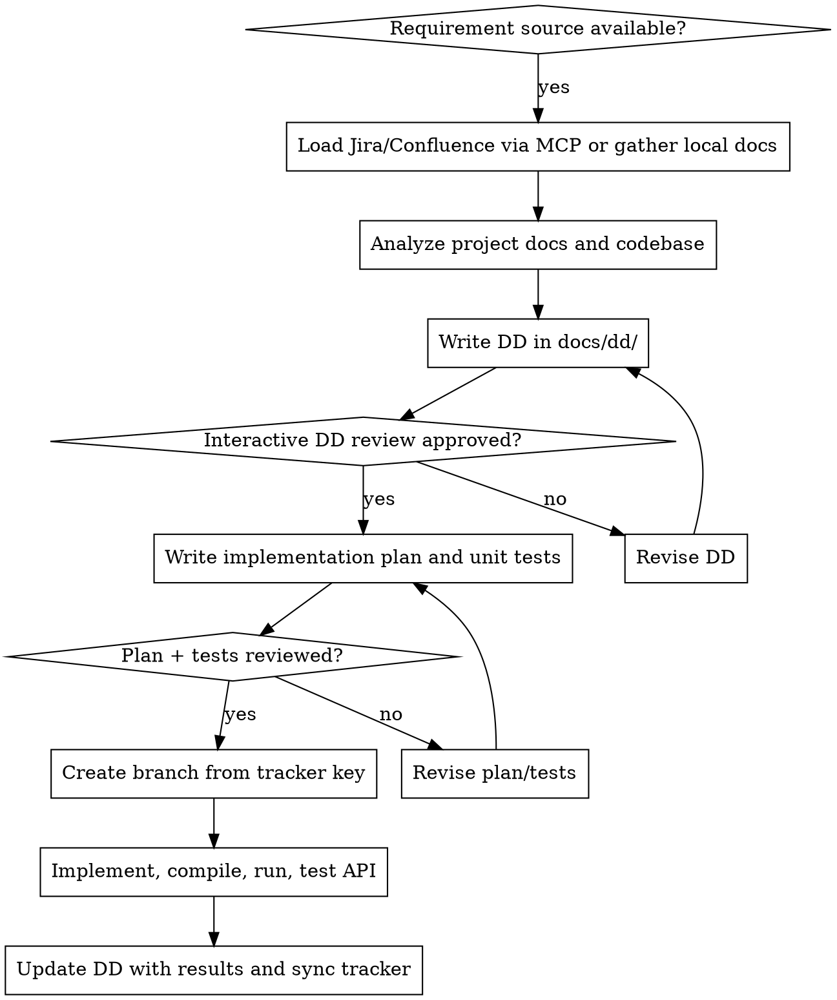

# Requirements-Driven Development

## Overview

Use this skill when implementation must be anchored to explicit requirements rather than jumping straight into code. The core rule is simple: no coding until the requirement source is captured, the local DD is written, and the human has reviewed it.

**Announce at start:** "I'm using requirements-driven-development to turn the requirement into a reviewed DD before planning or coding."

**Primary outputs:**
- DD document in `docs/dd/`
- Implementation plan after DD approval
- Failing or pending unit tests before implementation
- Branch name tied to the tracker key when available
- Final DD update plus Jira/Confluence status summary

## Fit Check

Choose the lightest workflow that still preserves traceability.

**Full RDD required when:**
- requirements are ambiguous or spread across multiple sources
- work crosses modules, services, or public APIs
- business rules or compliance constraints matter
- the ticket is tracker-backed and expected to be auditable

**Lightweight RDD allowed when all are true:**
- change is localized and low-risk
- requirements are already explicit
- no cross-service or schema design is involved
- a short DD still captures source snapshot, acceptance criteria, approval, and verification

Even in lightweight mode, do not skip the DD entirely. Shrink the document, not the traceability.

## Default Locations

- DD: `docs/dd/<jira-key-or-topic>.md`
- Plan: `docs/plans/<jira-key-or-topic>.md`

If the repository already has stronger conventions, follow them. If the user gives a path, that overrides the defaults.

## Workflow

## Phase 1: Acquire Requirement Sources

Prefer authoritative sources in this order:
1. Jira issue or epic
2. Confluence page linked from the issue
3. Local requirement or architecture docs
4. User-provided requirement text

When Atlassian MCP is available:
- Read the Jira issue, linked subtasks, acceptance criteria, labels, priority, and status
- Read linked Confluence pages for scope, business rules, APIs, diagrams, and rollout notes
- Persist a source snapshot in the DD
- At minimum capture: issue key or page ID, source URL or title, retrieved-at timestamp, current status or revision, and key requirement excerpts

When Atlassian MCP is not available:
- Say so plainly
- Ask for the issue key, exported text, or local requirement docs
- Do not invent acceptance criteria
- Record in the DD which source was missing and what fallback source was used

If the primary source is missing, incomplete, or inaccessible, also use `./references/requirement-source-fallback.md`.

Always capture:
- business goal
- in-scope and out-of-scope behavior
- actors and interfaces
- constraints and dependencies
- open questions and missing information
- requirement source provenance and retrieval time

## Phase 2: Analyze Existing Project Context

Before writing the DD, inspect the repository for:
- existing architecture and module boundaries
- relevant controllers, services, repositories, DTOs, and API contracts
- test patterns and fixtures
- build and runtime commands
- environment configuration and integration points
- the execution harness to use for validation: local shell, devcontainer, CI, or other approved runtime

If Git history or a code search/index tool is available, use it to understand recent decisions, but it is optional. Repository docs and current code are the primary sources.

## Phase 3: Write the DD

Write the first DD draft to `docs/dd/` before planning.

Reference selection:
- Default: use `./references/dd-template.md`
- Localized low-risk work in lightweight mode: use `./references/lightweight-dd-template.md`
- When you need examples for requirement-to-test mapping: use `./references/traceability-examples.md`

The DD should include:
- source requirements and links or IDs
- source snapshot with retrieval timestamp and issue/page status
- problem statement and target outcome
- current-state observations from docs and code
- refined functional and non-functional requirements
- assumptions, risks, and open questions
- acceptance criteria that can drive tests
- requirement-to-test traceability
- implementation approach at the design level, not task level

Mirror the user's language when practical. If the requirement source is Chinese, keep the DD in Chinese unless the user asks otherwise.

## Phase 4: Interactive Review Gate

After saving the DD:
- summarize the unresolved questions
- walk the human through the DD section by section
- ask for explicit approval before moving to planning

Approval must mean the DD is good enough to constrain implementation. "Looks fine" is acceptable only if the open questions are explicitly closed or deferred in the DD.

Record the review decision, reviewer, and timestamp in the DD. If approval is partial, capture exactly what remains out of scope.

## Phase 5: Plan and Unit Tests

Once the DD is approved:
- create the implementation plan
- derive unit and integration test cases directly from the DD acceptance criteria
- write or scaffold failing tests before implementation when the task moves into coding

**REQUIRED SUB-SKILL:** Use `superpowers:writing-plans` for the implementation plan.

When invoking plan writing, set these expectations:
- save the plan under `docs/plans/` unless the repo already standardizes another path
- keep tasks small and executable
- include exact file paths, commands, and expected outcomes
- reference the DD as the authority, not memory
- preserve requirement-to-test traceability from the DD

Before handing off to planning, use `./references/plan-and-test-handoff.md` to confirm the DD is ready and the acceptance criteria are mapped to tests.

For review, do not start coding until the human confirms both:
- the plan matches the DD
- the tests cover the acceptance criteria

## Phase 6: Branch, Code, Verify

After plan and tests are approved:
- create a branch named `<jira-key>-<short-slug>` when a tracker key exists
- otherwise use a descriptive branch name tied to the DD topic

**REQUIRED SUB-SKILLS:**
- `superpowers:using-git-worktrees`
- `superpowers:test-driven-development`
- `superpowers:subagent-driven-development` or `superpowers:executing-plans`

Implementation rules:
- keep commits scoped to plan tasks
- mention the tracker key in commit messages when appropriate
- update tests first when behavior changes
- do not silently expand scope beyond the DD
- verify in the agreed execution harness and record command lines plus outcomes

## Java Spring Boot Maven Checklist

For Java Spring Boot Maven projects, also use `./references/springboot-maven-checklist.md`.

Minimum verification:
- run targeted unit tests, then the relevant broader Maven test command
- compile with Maven before claiming done
- start the application locally
- exercise the changed API path with curl, httpie, or existing test clients
- record actual verification results in the DD

If the application cannot start locally because of missing secrets or infrastructure, document the blocker precisely and verify everything possible short of that dependency.

## Phase 7: Close the Loop

Before finishing:
- update the DD with what changed during implementation
- add final verification evidence, API results, and follow-up items
- write a short summary suitable for Jira or Confluence
- update the tracker status, comments, and links if the integration is available

The DD is a living record. Do not leave it as a pre-implementation draft once coding is done.

## Red Flags

Stop and correct course if any of these happen:
- coding starts before the DD is saved and reviewed
- acceptance criteria exist only in chat, not in the DD
- requirement source snapshots are missing, stale, or unverifiable
- the plan drifts from the DD without updating the DD first
- tests are written from implementation details instead of requirements
- branch names omit the tracker key even though one exists
- build or API verification is skipped without a documented blocker
- Jira or Confluence is updated from memory instead of the final DD

## Integration

Use this skill as the entry point when work is requirement-led.

- Before design clarification: `superpowers:brainstorming` if the requirement is still ambiguous
- For plan creation: `superpowers:writing-plans`
- For implementation: `superpowers:test-driven-development`
- For isolated execution: `superpowers:using-git-worktrees`
- For task execution: `superpowers:subagent-driven-development` or `superpowers:executing-plans`
- Before completion: `superpowers:verification-before-completion`
