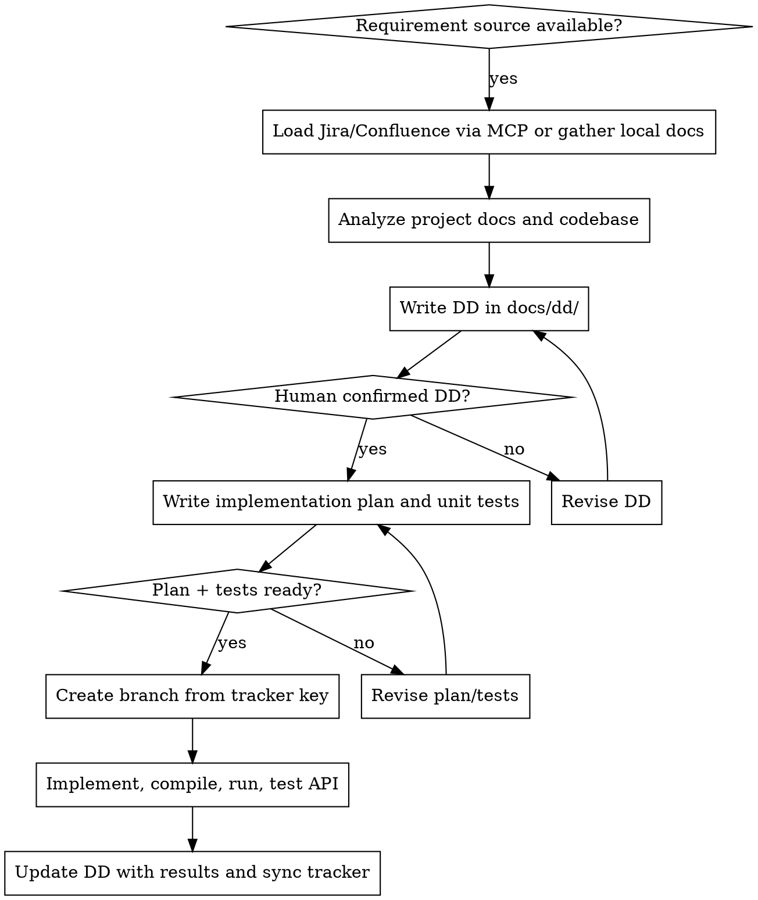

# Requirements-Driven Development

## Overview

Use this skill when implementation must be anchored to real requirements instead of guesses. If the requirement is still fuzzy, use this skill to explore and document it before committing to a plan or code. The core rule is simple: do not code until the current goal, scope, and open questions are captured and the human has confirmed the direction is acceptable.

**Announce at start:** "I'm using requirements-driven-development to clarify the requirement, capture it in a DD, and wait for human confirmation before planning or coding."

**Primary outputs:**
- DD document in `docs/dd/`, even if it starts as a draft for discussion
- Implementation plan once the DD is confirmed
- Tests or verification notes before implementation when they add value
- Branch name tied to the tracker key when available
- Final DD update plus Jira/Confluence status summary

## Fit Check

Use one DD template for all cases. Scale it by deleting irrelevant sections, not by switching to a different template.

Start in discovery mode when the user is still figuring out the requirement. The skill should help surface options, assumptions, and tradeoffs instead of pretending the requirement is already settled.

**Full RDD required when:**
- requirements are ambiguous or spread across multiple sources
- work crosses modules, services, or public APIs
- business rules or compliance constraints matter
- the ticket is tracker-backed and expected to be auditable

For small changes:
- keep the same DD template
- keep only the sections that add signal
- prefer short bullets over prose
- do not skip source, scope, decisions, and verification

## Default Locations

- DD: `docs/dd/<jira-key-or-topic>.md`
- Plan: `docs/plans/<jira-key-or-topic>.md`

If the repository already has stronger conventions, follow them. If the user gives a path, that overrides the defaults.

## Workflow

```dot
digraph rdd_flow {
    rankdir=TB;
    "Requirement source available?" [shape=diamond];
    "Load Jira/Confluence via MCP or gather local docs" [shape=box];
    "Analyze project docs and codebase" [shape=box];
    "Write DD in docs/dd/" [shape=box];
    "Human confirmed DD?" [shape=diamond];
    "Revise DD" [shape=box];
    "Write implementation plan and unit tests" [shape=box];
    "Plan + tests ready?" [shape=diamond];
    "Revise plan/tests" [shape=box];
    "Create branch from tracker key" [shape=box];
    "Implement, compile, run, test API" [shape=box];
    "Update DD with results and sync tracker" [shape=box];

    "Requirement source available?" -> "Load Jira/Confluence via MCP or gather local docs" [label="yes"];
    "Load Jira/Confluence via MCP or gather local docs" -> "Analyze project docs and codebase";
    "Analyze project docs and codebase" -> "Write DD in docs/dd/";
    "Write DD in docs/dd/" -> "Human confirmed DD?";
    "Human confirmed DD?" -> "Revise DD" [label="no"];
    "Revise DD" -> "Write DD in docs/dd/";
    "Human confirmed DD?" -> "Write implementation plan and unit tests" [label="yes"];
    "Write implementation plan and unit tests" -> "Plan + tests ready?";
    "Plan + tests ready?" -> "Revise plan/tests" [label="no"];
    "Revise plan/tests" -> "Write implementation plan and unit tests";
    "Plan + tests ready?" -> "Create branch from tracker key" [label="yes"];
    "Create branch from tracker key" -> "Implement, compile, run, test API";
    "Implement, compile, run, test API" -> "Update DD with results and sync tracker";
}
```

## Phase 0: Discovery And Brainstorming

If the user is unsure what they want, do not force fake precision up front.

In discovery mode:
- identify the problem, user goal, and constraints first
- separate facts from assumptions
- surface options and tradeoffs in plain language
- capture unresolved questions in the DD as draft items
- use `superpowers:brainstorming` when it helps, but inline clarification is also fine

The output of this phase can be a draft DD with open questions. That is acceptable. The purpose is to reduce ambiguity, not to simulate certainty.

## Phase 1: Acquire Requirement Sources

Prefer authoritative sources in this order:
1. Jira issue or epic
2. Confluence page linked from the issue
3. Local requirement or architecture docs
4. User-provided requirement text

When Atlassian MCP is available:
- Read the Jira issue, linked subtasks, labels, priority, and status
- Capture acceptance criteria if the source already provides them
- Read linked Confluence pages for scope, business rules, APIs, diagrams, and rollout notes
- Persist a source snapshot in the DD
- At minimum capture: issue key or page ID, source URL or title, retrieved-at timestamp, current status or revision, and key requirement excerpts

When Atlassian MCP is not available:
- Say so plainly
- Ask for the issue key, exported text, or local requirement docs
- Do not invent formal acceptance criteria when the source does not define them
- Record in the DD which source was missing and what fallback source was used

If the primary source is missing, incomplete, or inaccessible, also use `./references/requirement-source-fallback.md`.

Always capture:
- business goal
- in-scope and out-of-scope behavior
- actors and interfaces
- constraints and dependencies
- open questions and missing information
- requirement source provenance and retrieval time

## Phase 2: Analyze Existing Project Context

Before writing the DD, inspect the repository for:
- existing architecture and module boundaries
- relevant controllers, services, repositories, DTOs, and API contracts
- test patterns and fixtures
- build and runtime commands
- environment configuration and integration points
- the execution harness to use for validation: local shell, devcontainer, CI, or other approved runtime

If Git history or a code search/index tool is available, use it to understand recent decisions, but it is optional. Repository docs and current code are the primary sources.

## Phase 3: Write the DD

Write the first DD draft to `docs/dd/` before planning. It can start as a working draft rather than a polished spec.

Reference selection:
- Default: use `./references/dd-template.md`
- When you need examples for requirement-to-test mapping: use `./references/traceability-examples.md`

The DD should include:
- source requirements and links or IDs
- source snapshot with retrieval timestamp and issue/page status
- problem statement and target outcome
- current-state observations from docs and code
- refined functional and non-functional requirements
- assumptions, risks, and open questions
- acceptance criteria or verification expectations when they help constrain the work
- requirement-to-test traceability when it adds clarity
- implementation approach at the design level, not task level

Do not over-specify unknowns just to fill the template. A DD with clearly labeled open questions is better than a fake-complete DD.

Mirror the user's language when practical. If the requirement source is Chinese, keep the DD in Chinese unless the user asks otherwise.

## Phase 4: Human Confirmation

After saving the DD:
- summarize the unresolved questions
- walk the human through the DD section by section when needed
- ask for confirmation that the DD direction is acceptable for the next step

Confirmation must mean the DD is acceptable for the next step. For small or low-risk work, "Looks fine" is acceptable if the remaining open questions are explicitly deferred in the DD.

Record the review decision, reviewer, and timestamp in the DD when that level of ceremony matters. Otherwise record a short note showing what was agreed and what remains deferred.

## Phase 5: Plan and Unit Tests

Once the DD is confirmed:
- create the implementation plan
- derive unit and integration tests from the DD requirements, acceptance criteria, or key risks
- write or scaffold failing tests before implementation when the task moves into coding and test-first work is practical

**REQUIRED SUB-SKILL:** Use `superpowers:writing-plans` for the implementation plan. If that skill is not available, create the plan inline following the same task / file-path / command / expected-outcome structure.

When invoking plan writing, set these expectations:
- save the plan under `docs/plans/` unless the repo already standardizes another path
- keep tasks small and executable
- include exact file paths, commands, and expected outcomes
- reference the DD as the authority, not memory
- preserve requirement-to-test traceability from the DD

Before handing off to planning, confirm the DD has the current goal, scope, open questions, and the planned tests or verification steps for the changed behavior.

For review, do not start coding until the human confirms both:
- the plan matches the DD
- the tests or verification steps cover the changed behavior well enough for the task

For very small changes, the plan can be lightweight. The bar is not "formal approval"; the bar is "the human has confirmed the current direction is acceptable."

## Phase 6: Branch, Code, Verify

After plan and tests are ready:
- create a branch named `<jira-key>` when a tracker key exists
- otherwise use a descriptive branch name tied to the DD topic

**REQUIRED SUB-SKILLS:**
- `superpowers:using-git-worktrees` — if not available, work directly on a named branch
- `superpowers:test-driven-development` — if not available, write failing tests manually before each implementation task
- `superpowers:subagent-driven-development` when the plan has parallel or independent tasks; `superpowers:executing-plans` when tasks are sequential or tightly coupled — if neither is available, execute the plan step by step inline

Implementation rules:
- keep commits scoped to plan tasks
- mention the tracker key in commit messages when appropriate
- update tests first when behavior changes
- do not silently expand scope beyond the DD
- verify in the agreed execution harness and record command lines plus outcomes

## Java Spring Boot Maven Checklist

For Java Spring Boot Maven projects, also use `./references/springboot-maven-checklist.md`.

Minimum verification:
- run targeted unit tests, then the relevant broader Maven test command
- compile with Maven before claiming done
- start the application locally
- exercise the changed API path with curl, httpie, or existing test clients
- record actual verification results in the DD

If the application cannot start locally because of missing secrets or infrastructure, document the blocker precisely and verify everything possible short of that dependency.

## Phase 7: Close the Loop

Before finishing:
- update the DD with what changed during implementation
- add final verification evidence, API results, and follow-up items
- write a short summary suitable for Jira or Confluence
- update the tracker status, comments, and links if the integration is available

The DD is a living record. Do not leave it as a pre-implementation draft once coding is done.

## Red Flags

Stop and correct course if any of these happen:
- coding starts before the DD captures enough shared understanding for the current task
- important requirements or decisions exist only in chat, not in the DD
- requirement source snapshots are missing, stale, or unverifiable
- the plan drifts from the DD without updating the DD first
- tests are written from implementation details instead of requirements or risk
- branch names omit the tracker key even though one exists
- build or API verification is skipped without a documented blocker
- Jira or Confluence is updated from memory instead of the final DD

## Integration

Use this skill as the entry point when work is requirement-led.

- Before or during clarification: `superpowers:brainstorming` if the requirement is still ambiguous
- For plan creation: `superpowers:writing-plans`
- For implementation: `superpowers:test-driven-development`
- For isolated execution: `superpowers:using-git-worktrees`
- For task execution: `superpowers:subagent-driven-development` or `superpowers:executing-plans`
- Before completion: `superpowers:verification-before-completion`
